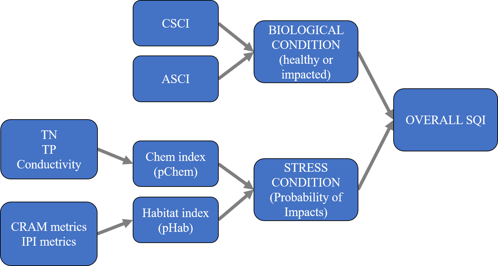
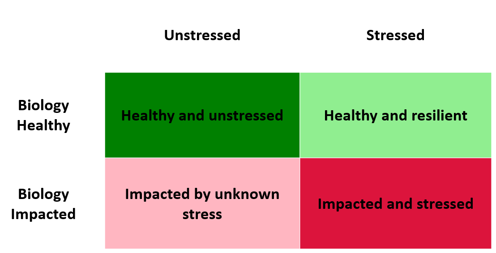
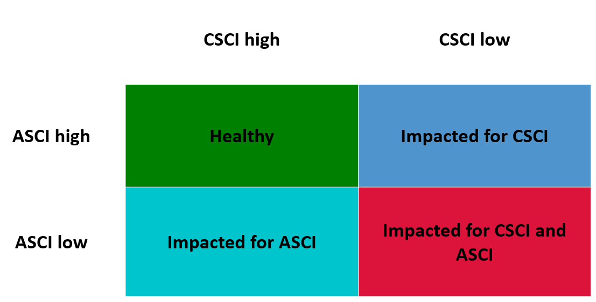
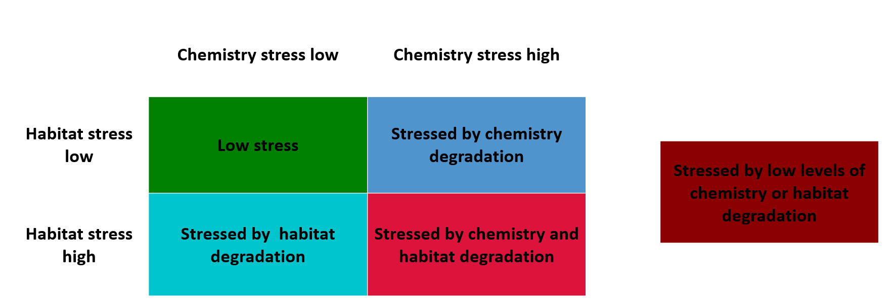
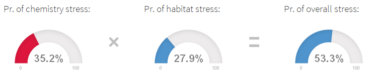
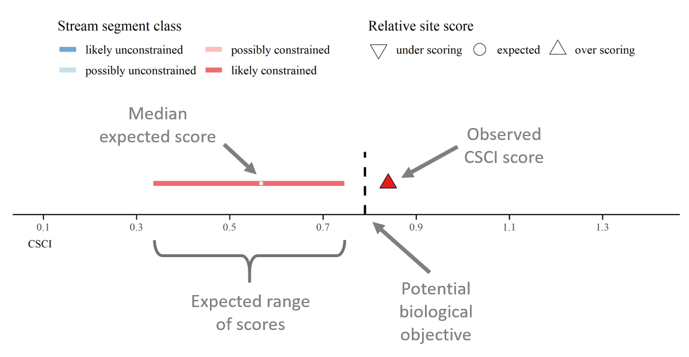

<style>
#map {
  height: calc(100vh - 235px) !important;
} 
</style>

```{r global, include = FALSE, message = F, warning = F}
knitr::opts_chunk$set(echo = TRUE, warning = F, message = F, echo = F)
# options(shiny.reactlog = T)

# packages
library(shiny)
library(tidyverse)
library(randomForest)
library(patchwork)
library(flexdashboard)
library(SQI)
library(mapview)
library(leaflet)
library(sf)
library(shinyWidgets)
library(here)
library(shinycssloaders)
library(RColorBrewer)
library(shinydashboard)

downloadButtonRmd <- function (outputId, label = "Download", class = NULL, ...)  {
  tags$a(id = outputId, class = paste("btn btn-default shiny-download-link", 
                                      class), href = "", target = "_blank", download = NA, 
         icon("download"), label, ...)
}

# source functions and data
source(here('R', 'funcs.R'))
# data(sqidat)
data(sheds)
data(cntys)
data(rwqbs)
data(cnstr)

# testing new data
data(sqidat_fordash)
sqidat <- sqidat_fordash

# numeric variable names
numnms <- c('CSCI', 'ASCI', 'TN', 'TP', 'Cond', 'indexscore_cram', 'IPI', 'blc', 'bs', 'ps', 'hy', 'PCT_SAFN', 'H_AqHab', 'H_SubNat',  'Ev_FlowHab', 'XCMG')
numlab <- c('CSCI', 'ASCI', 'Total nitrogen', 'Total phosphorus', 'Conductivity', 'CRAM index score', 'Index of physical integrity', 'Buffer and landscape', 'Biotic structure', 'Physical structure', 'Hydrologic condition', '% sands and fines', 'Diversity of habitat', 'Diversity of substrate', 'Evenness of flow habitat', 'Riparian veg. cover')
names(numnms) <- numlab

# color lims
cscilim <- c(0, 0.63, 0.79, 1)
ascilim <- c(0, 0.70, 0.83, 1)
tnlim <- c(2, 1, 0.5, 0)
tplim <- c(0.2, 0.1, 0.05, 0)
condlim <- c(2000, 1200, 600, 0)
cramlim <- c(0, 63, 72, 100)
ipilim <- c(0, 0.71, 0.84, 1)
blclim <- c(0, 72, 82, 100)
bslim <- c(0, 38, 54, 100)
pslim <- c(0, 44, 60, 100)
hylim <- c(0, 51, 64, 100)
safnlim <- c(0, 0.16, 0.32, 1)
aqhablim <- c(0, 0.16, 0.32, 1)
subnatlim <- c(0, 0.16, 0.32, 1)
flowhablim <- c(0, 0.16, 0.32, 1)
veglim <- c(0, 0.16, 0.32, 1)

# for boxplot color limits
collims <- list(cscilim, ascilim, tnlim, tplim, condlim, cramlim, ipilim, blclim, bslim, pslim, hylim, safnlim, aqhablim, subnatlim, flowhablim, veglim)
names(collims) <- numlab
collims <- enframe(collims, 'var', 'lims')

# all colors used for categories
allcol <- getdsccol(palout = T)

# gauge cols, red, orange, green
gauge_col <- c('#a9d70b', '#f9c802', '#ff0000')

# round sqidat variables so gauge colors match relative plot colors
sqidat <- sqidat %>% 
  gather('var', 'val', ASCI, blc, bs, Cond, CSCI, Ev_FlowHab, H_AqHab, H_SubNat, hy, indexscore_cram, IPI, PCT_SAFN, ps, TN, TP, XCMG) %>% 
  mutate(
    val = case_when(
      var %in% c('Cond', 'indexscore_cram', 'blc', 'bs', 'hy', 'ps') ~ round(val, 1), 
      var %in% c('ASCI', 'CSCI', 'Ev_FlowHab', 'H_AqHab', 'H_SubNat', 'IPI', 'PCT_SAFN', 'TN', 'TP', 'XCMG') ~ round(val, 2)
      )
    ) %>% 
  spread(var, val)
  
```

```{r reactives}
# selected site for results
cats <- reactive({

  req(nrow(sitedat()) > 0)
  
  # inputs
  sitedat <- sitedat()
  
  # subset
  out <- sitedat %>% 
    filter(MasterID %in% selsit)
  
  return(out)
  
  })

# choices for spatial filter
spaflt <- reactive({
  
  # input
  flby <- input$flby
  
  if(flby == 'SMC watersheds')
    out <- sheds %>% 
      rename(polylab = SMC_Name)
          
  if(flby == 'Counties')
    out <- cntys %>% 
      rename(polylab = cnty)
  
  if(flby == 'Regional boards')
    out <- rwqbs %>% 
      rename(polylab = RBNAME)
  
  if(flby == 'Constraint classes'){
    out <- c('likely unconstrained', 'possibly unconstrained', 'possibly constrained', 'likely constrained')
    return(out)
  }
  
  if(flby == 'Years'){
    out <- as.character(seq(2009, 2016))
    return(out)
    }
  
  out <- out %>% 
    pull(polylab) %>% 
    sort %>% 
    as.character
  
  return(out)
  
})

# selected shed or county polygons, filtered
polys <- reactive({
  
  # inputs
  flby <- input$flby
  flts <- input$flts
      
  if(flby == 'SMC watersheds')
    out <- sheds %>% 
      rename(pllb = SMC_Name)

  if(flby == 'Counties')
    out <- cntys %>% 
      rename(pllb = cnty)
  
  if(flby == 'Regional boards')
    out <- rwqbs %>% 
      rename(pllb = RBNAME)
  
  if(flby %in% c('Constraint classes', 'Years')){ # use sheds as base
    out <- sheds %>% 
      rename(pllb = SMC_Name)
    return(out)
  }

  # filter by selection
  out <- out %>% 
    filter(pllb %in% flts)
  
  return(out)
  
})

# filter site data by spatial 
sitedat <- reactive({
  
  # input
  flts <- input$flts
  flby <- input$flby
  polys <- polys()
  
  if(flby == 'Constraint classes'){
    out <- sqidat %>% 
      filter(strcls %in% flts)
    return(out)
  }
  
  if(flby == 'Years'){
    out <- sqidat %>% 
      filter(yr %in% as.numeric(flts))
    return(out)
  }
    
  out <- sqidat[polys, ]
  
  return(out)
  
})

# expected scores plot from landscape model
expplo <- reactive({
  
  cats <- cats()
  
  req(nrow(cats) > 0)
  
  p <- expplo_fun(cats)
  
  return(p)
  
})

# distribution of conditions for selected sites given spatial filter
dstdat <- reactive({
  
  # input
  sitedat <- sitedat()

  # aggregate 
  out <- sitedat
  st_geometry(out) <- NULL
  out <- out %>% 
    select_if(is.numeric) %>% 
    gather('var', 'val') %>% 
    filter(var %in% numnms) %>% 
    mutate(
      var = factor(var, levels = numnms, labels = names(numnms)),
      val = as.numeric(val)
    )

  return(out)
  
})

# selected site data but in long format
catslng <- reactive({
  
  # input
  cats <- cats()
  
  # format selected data
  st_geometry(cats) <- NULL
  out <- cats %>% 
    select_if(is.numeric) %>% 
    gather('var', 'val') %>% 
    filter(var %in% numnms) %>% 
    mutate(
      var = factor(var, levels = numnms, labels = names(numnms)), 
      val = as.numeric(val)
    )
  
  return(out)
  
})

# distribution boxplots, biology
dstbio <- reactive({
  
  # only do it a site has been selected
  req(nrow(catslng()) > 0)

  # input
  dstdat <- dstdat()
  catslng <- catslng()
  
  # filters
  selvr <- numlab[c(1:2)]

  # get boxplots
  out <- dst_fun(catslng, dstdat, selvr, collims)
  
  return(out)
  
})

# distribution boxplots, chemistry
dstchm <- reactive({
  
  # only do it a site has been selected
  req(nrow(catslng()) > 0)
  
  # input
  dstdat <- dstdat()
  catslng <- catslng()
  
  # filters
  selvr <- numlab[c(3:5)]
  
  # get boxplots
  out <- dst_fun(catslng, dstdat, selvr, collims)
  
  return(out)
  
})

# distribution boxplots, habitat
dsthab <- reactive({
  
  # only do it a site has been selected
  req(nrow(catslng()) > 0)
  
  # input
  dstdat <- dstdat()
  catslng <- catslng()
  
  # filters
  selvr <- numlab[c(6:7)]
  
  # get boxplots
  out <- dst_fun(catslng, dstdat, selvr, collims)
  
  return(out)
  
})

# distribution boxplots, CRAM components
dstcrm <- reactive({
  
  # only do it a site has been selected
  req(nrow(catslng()) > 0)
  
  # input
  dstdat <- dstdat()
  catslng <- catslng()
  
  # filters
  selvr <- numlab[c(8:11)]
  
  # get boxplots
  out <- dst_fun(catslng, dstdat, selvr, collims)
  
  return(out)
  
})

# distribution boxplots, ipi components
dstipi <- reactive({
  
  # only do it a site has been selected
  req(nrow(catslng()) > 0)
  
  # input
  dstdat <- dstdat()
  catslng <- catslng()
  
  # filters
  selvr <- numlab[c(12:16)]
  
  # get boxplots
  out <- dst_fun(catslng, dstdat, selvr, collims)
  
  return(out)
  
})

```

```{r outputobj}
output$map <- renderLeaflet({

  # input
  tomap <- input$tomap
  polys <- polys()
  sitedat <- sitedat()

  req(nrow(polys) > 0)
  
  # assign colors
  cols <- getdsccol(sitedat[[tomap]])
  names(cols) <- NULL
  names(sitedat)[names(sitedat) %in% tomap] <- 'toshw'
  
  # legend stuff
  legcols <- getdsccol(palfac = tomap)

  mapview(polys, fill = F, label = polys$pllb, homebutton = F, popup = NULL, legend = F) %>% 
    .@map %>% 
    # removeMouseCoordinates() %>% #this function no longer seems to be available in leaflet
    addCircleMarkers(
      data = sitedat, 
      layerId = ~MasterID,
      stroke = TRUE,
      color = 'black',
      fill = TRUE,
      fillColor = cols,
      radius=5, 
      weight = 1,
      fillOpacity = 1,
      label = ~paste0(MasterID, ' (', yr, '): ', toshw)
    ) %>% 
    addLegend("bottomleft", colors = legcols$col, labels = legcols$nms, opacity = 1)

})

# leaflet proxy for marker select
map <- leafletProxy("map")

# binding for marker select and year
makeReactiveBinding('selsit')

# the selection
observeEvent(input$map_marker_click, {
  selsit <<- input$map_marker_click$id
})

observeEvent(input$map_marker_click, {

  # inputs
  tomap <- input$tomap
  sitedat <- sitedat()
  
  # colors
  cols <- getdsccol(sitedat[[tomap]])
  names(cols) <- NULL
  names(sitedat)[names(sitedat) %in% tomap] <- 'toshw'
  
  # filter the pour points by selection
  selsitplo <- sitedat %>% 
    filter(MasterID %in% selsit)
  selsitplocol <- getdsccol(selsitplo[['toshw']])
  names(selsitplocol) <- NULL
  
  # clear markers on input select, add all points and selected point
  map <- map %>% 
    clearMarkers() %>% 
    addCircleMarkers(
      data = sitedat, 
      layerId = ~MasterID,
      stroke = TRUE,
      color = 'black',
      fill = TRUE,
      fillColor = cols,
      radius=5, 
      weight = 1,
      fillOpacity = 1,
      label = ~paste0(MasterID, ' (', yr, '): ', toshw)
    ) %>% 
    addCircleMarkers(
      data = selsitplo, 
      layerId = ~MasterID,
      stroke = TRUE,
      color = 'black',
      fillColor = selsitplocol,
      fill = TRUE,
      radius=10, 
      weight = 6,
      fillOpacity = 1,
      label = ~paste0(MasterID, ' (', yr, '): ', toshw)
    )
      
})

##
# SQI descriptor outputs
output$overall <- flexdashboard::renderValueBox({
  req(nrow(cats()) > 0)
  txtin <- cats()$StreamHealthIndex
  colin <- getdsccol(txtin)
  flexdashboard::valueBox(tags$p(txtin, style = "font-size: 60%"), icon = 'glyphicon-plus', color = colin)
  })
output$biolcon <- flexdashboard::renderValueBox({
  req(nrow(cats()) > 0)
  txtin <- cats()$BiologicalCondition
  colin <- getdsccol(txtin)
  flexdashboard::valueBox(tags$p(txtin, style = "font-size: 60%"), icon = 'glyphicon-leaf', color = colin)
  })
output$strsdet <- flexdashboard::renderValueBox({
  req(nrow(cats()) > 0)
  txtin <- cats()$OverallStressCondition_detail
  colin <- getdsccol(txtin)
  flexdashboard::valueBox(tags$p(txtin, style = "font-size: 60%"), icon = 'glyphicon-flash', color = colin)
  })

##
# probability gauge outputs
output$pchemhab <- renderGauge({
  
    val <- round(100 * cats()$pChemHab, 1)
    gauge(val, min = 0, max = 100, symbol = '%', gaugeSectors(
     success = c(0, 10), warning = c(10, 90), danger = c(90, 100),
     colors = allcol[c(1, 5, 4)]
    ))
             
  })
output$pchem <- renderGauge({
  
  val <- round(100 * cats()$pChem, 1)
  gauge(val, min = 0, max = 100, symbol = '%', gaugeSectors(
     success = c(0, 10), warning = c(10, 90), danger = c(90, 100),
     colors = allcol[c(1, 5, 4)]
  ))
  
})
output$phab <- renderGauge({
  val <- round(100 * cats()$pHab, 1)
  gauge(val, min = 0, max = 100, symbol = '%', gaugeSectors(
     success = c(0, 10), warning = c(10, 90), danger = c(90, 100),
     colors = allcol[c(1, 5, 4)]
  )
  )
  
})

##
# scape expected score plot
output$expplo <- renderPlot({
  
  req(!is.na(cats()))
  
  validate(
    need(!is.na(cats()$strcls), 'No landscape model data')
  )
  
  expplo()
  
}, height = 165)

##
# detail gauge outputs
output$csci <- renderGauge({
  val <- cats()$CSCI
  gauge(val, min = cscilim[1], max = cscilim[4], gaugeSectors(
     danger = cscilim[c(1, 2)], warning = cscilim[c(2, 3)], success = cscilim[c(3, 4)], 
     colors = gauge_col)
  )
})
output$asci <- renderGauge({
  val <- cats()$ASCI
  gauge(val, min = ascilim[1], max = ascilim[4], gaugeSectors(
     danger = ascilim[c(1, 2)], warning = ascilim[c(2, 3)], success = ascilim[c(3, 4)], 
     colors = gauge_col)
  )
})
output$tn <- renderGauge({
  val <- cats()$TN
  gauge(val, min = tnlim[4], max = tnlim[1], gaugeSectors(
     danger = tnlim[c(2, 1)], warning = tnlim[c(3, 2)], success = tnlim[c(4, 3)], 
     colors = gauge_col)
  )
})
output$tp <- renderGauge({
  val <- cats()$TP
  gauge(val, min = tplim[4], max = tplim[1], gaugeSectors(
     danger = tplim[c(2, 1)], warning = tplim[c(3, 2)], success = tplim[c(4, 3)], 
     colors = gauge_col)
  )
})
output$cond <- renderGauge({
  val <- cats()$Cond
  gauge(val, min = condlim[4], max = condlim[1], gaugeSectors(
     danger = condlim[c(2, 1)], warning = condlim[c(3, 2)], success = condlim[c(4, 3)], 
     colors = gauge_col)
  )
})
output$cram <- renderGauge({
  val <- cats()$indexscore_cram
  gauge(val, min = cramlim[1], max = cramlim[4], gaugeSectors(
     danger = cramlim[c(1, 2)], warning = cramlim[c(2, 3)], success = cramlim[c(3, 4)], 
     colors = gauge_col)
  )
})
output$ipi <- renderGauge({
  val <- cats()$IPI
  gauge(val, min = ipilim[1], max = ipilim[4], gaugeSectors(
     danger = ipilim[c(1, 2)], warning = ipilim[c(2, 3)], success = ipilim[c(3, 4)], 
     colors = gauge_col)
  )
})
output$blc <- renderGauge({
  val <- cats()$blc
  gauge(val, min = blclim[1], max = blclim[4], gaugeSectors(
     danger = blclim[c(1, 2)], warning = blclim[c(2, 3)], success = blclim[c(3, 4)], 
     colors = gauge_col)
  )
})
output$bs <- renderGauge({
  val <- cats()$bs
  gauge(val, min = bslim[1], max = bslim[4], gaugeSectors(
     danger = bslim[c(1, 2)], warning = bslim[c(2, 3)], success = bslim[c(3, 4)], 
     colors = gauge_col)
  )
})
output$hy <- renderGauge({
  val <- cats()$hy
  gauge(val, min = hylim[1], max = hylim[4], gaugeSectors(
     danger = hylim[c(1, 2)], warning = hylim[c(2, 3)], success = hylim[c(3, 4)], 
     colors = gauge_col)
  )
})
output$ps <- renderGauge({
  val <- cats()$ps
  gauge(val, min = pslim[1], max = pslim[4], gaugeSectors(
     danger = pslim[c(1, 2)], warning = pslim[c(2, 3)], success = pslim[c(3, 4)], 
     colors = gauge_col)
  )
})
output$safn <- renderGauge({
  val <- cats()$PCT_SAFN
  gauge(val, min = safnlim[1], max = safnlim[4], gaugeSectors(
     danger = safnlim[c(1, 2)], warning = safnlim[c(2, 3)], success = safnlim[c(3, 4)], 
     colors = gauge_col)
  )
})
output$aqhab <- renderGauge({
  val <- cats()$H_AqHab
  gauge(val, min = aqhablim[1], max = aqhablim[4], gaugeSectors(
     danger = aqhablim[c(1, 2)], warning = aqhablim[c(2, 3)], success = aqhablim[c(3, 4)], 
     colors = gauge_col)
  )
})
output$subnat <- renderGauge({
  val <- cats()$H_SubNat
  gauge(val, min = subnatlim[1], max = subnatlim[4], gaugeSectors(
     danger = subnatlim[c(1, 2)], warning = subnatlim[c(2, 3)], success = subnatlim[c(3, 4)],
     colors = gauge_col)
  )
})
output$flowhab <- renderGauge({
  val <- cats()$Ev_FlowHab
  gauge(val, min = flowhablim[1], max = flowhablim[4], gaugeSectors(
     danger = flowhablim[c(1, 2)], warning = flowhablim[c(2, 3)], success = flowhablim[c(3, 4)], 
     colors = gauge_col)
  )
})
output$veg <- renderGauge({
  val <- cats()$XCMG
  gauge(val, min = veglim[1], max = veglim[4], gaugeSectors(
     danger = veglim[c(1, 2)], warning = veglim[c(2, 3)], success = veglim[c(3, 4)], 
     colors = gauge_col)
  )
})

##
# plots 

# distribution boxplots, biology
output$plodstbio <- renderPlot({
  
  # input
  dstplo <- dstbio()

  # patchwork
  wrap_plots(dstplo$plos, nrow = 1)
  
}, height = 180)

# distribution boxplots, chemistry
output$plodstchm <- renderPlot({
  
  # input
  dstplo <- dstchm()

  # patchwork
  wrap_plots(dstplo$plos, nrow = 1)
  
}, height = 180)

# distribution boxplots, habitat
output$plodsthab <- renderPlot({
  
  # input
  dstplo <- dsthab()

  # patchwork
  wrap_plots(dstplo$plos, nrow = 1)
  
}, height = 180)

# distribution boxplots, cram components
output$plodstcrm <- renderPlot({
  
  # input
  dstplo <- dstcrm()

  # patchwork
  wrap_plots(dstplo$plos, nrow = 1)
  
}, height = 180)

# distribution boxplots,ipi components
output$plodstipi <- renderPlot({
  
  # input
  dstplo <- dstipi()

  # patchwork
  wrap_plots(dstplo$plos, nrow = 1)
  
}, height = 180)

##
# data download

# download handler for data selected by spatial filter
output$dltab <- downloadHandler(
  filename = function() {'sqidata.csv'},
  content = function(file) {

    # format output
    todl <- formdl_fun(sitedat())
    
    write.csv(todl, file, quote = T, row.names = F)
    
  }
)
```


Sidebar {.sidebar data-width=700}
===========================================================

```{r}
# select spatial filter
column(width = 12, 
  
  column(width = 6, 
         
    selectInput('flby', 'Filter by:', choices = c('SMC watersheds', 'Counties', 'Regional boards', 'Constraint classes', 'Years'))
                
  ), 
  
  column(width = 6, 
         
    renderUI({
      
      # input
      spaflt <- spaflt()

      pickerInput(inputId = "flts", label = 'Select site filters:', choices = spaflt,
        options = list(`actions-box` = TRUE, size = 20), selected = spaflt, multiple = TRUE)      
      
    })
           
  )
       
)

# select index output on map and site selection text
column(width = 12, 
       
  column(width = 6, 
                
    selectInput('tomap', 'SQI map output:', 
      choices = list(
        'Overall' = 'StreamHealthIndex', 
        'Biological condition' = 'BiologicalCondition',
        'Stress condition' = 'OverallStressCondition_detail'
      ), 
      selected = 'Overall'
    )
  
  ),
  
  column(width = 6, 
         
    renderText({
      
      txt <- 'Selected site: '

      if(nrow(cats()) > 0){
        
        # get lat lon       
        crds <- cats()$geometry
        crds <- round(crds[[1]][c(1, 2)], 4)
        
        # append all to text output
        txt <- paste0(txt, selsit, ' (Year ', cats()$yr, ', COMID ', cats()$COMID, ', ', crds[1], 'W/', crds[2], 'N)')
        
      }
      
      return(txt)
      
    })
    
  )
  
)
```

```{r}
leafletOutput('map')
```

Overview
=====================================

Column {data-width=500}
------------------------------------------------------------------------

### Welcome to the Stream Quality Index (SQI) dashboard!

<br>

<br>

This interactive web page will allow you to explore SQI scores for stream sampling sites from the Stormwater Monitoring Coalition (SMC) Data Portal.  Start by selecting a site by clicking a location on the map to the left.  Scroll through the SQI **Scores**, score **Details**, and **Relative details** for the selected site using the menu selections on the top. 

Please visit [here](https://sccwrp.shinyapps.io/SQI_Shiny/sqi_calc.Rmd) to calculate your own SQI scores.

```{r}
fluidRow(
  column(12, 'Click here to download SQI data from the map:'),
  column(2, downloadButtonRmd('dltab', ''))
)
```

#### SQI structure

The SQI combines biological, physical, and chemical data to provide an overall picture of stream quality.  

```{r, out.width = "75%", fig.align = 'center'}

```

Water chemistry (TN, TP, conductivity) and physical habitat (CRAM, IPI, PHAB metrics) provide information on in-stream stressors.   The CSCI (California Stream Condition Index) and ASCI (Algal Stream Condition Index) provide information on biological condition.  The stressor data are synthesized into a stressor index that describes the joint probability of stream condition being affected by chemistry or physical habitat stressors.  Similarly, the biological data are synthesized into an overall biological response index.  Together, the stressor and response indices describe the overall condition represented by the SQI.  

#### SQI scores

The SQI can describe stream quality relative to an overall score, the biological condition, and the stress condition.  This information for a selected site can be viewed on the **Scores** tab and for all sites on the map using the dropdown menu:

```{r, out.width = '50%', fig.align = 'center'}
knitr::include_graphics('www/map_options.png')
```

The overall SQI score for a site (far right on the above figure) is based on the categorical combinations of biological (healthy, impacted) and stressor (unstressed, stressed) conditions.  Based on these combinations, a site is assigned one of four categorical scores shown below.  

```{r, out.width = "50%", fig.align = 'center'}

```

Biological and stressor components that are used to create the overall SQI score are also categorized.  The biological condition at a site is assigned to one of four categories shown below based on observed CSCI and ASCI scores. 

```{r, out.width = "50%", fig.align = 'center'}

```

The stress condition for a site is assigned to one of five categories.

```{r, out.width = "80%", fig.align = 'center'}

```

The stress condition at a site is based on a modelled probability of biology being impacted by different combinations of stressors.  This information can be viewed on the **Scores** tab as the probability of chemistry stress, habitat stress, and overall stress as the product of the two.  For example, this site has an overall "moderate" stress condition (based on probability of overall stress) and stress condition detail as "stressed by chemistry degradation".

```{r, out.width = "80%", fig.align = 'center'}

```

Finally, the expected lower and upper CSCI score for a site (if available) is shown to provide context for the observed CSCI score.  These limits are based on a landscape model that predicts the ranges of CSCI scores that are likely possible relative to the landscape development in the watershed for a stream reach. This provides information on whether a site is under scoring, over scoring, or scoring as expected relative to the landscape model predictions and can provide a basis for prioritization.  Please visit the [SCAPE](https://sccwrp.shinyapps.io/scape/) application for additional details. Note that this information is currently unavailable for the ASCI.  

```{r, out.width = "75%", fig.align = 'center'}

```

#### Details

The **Details** tab shows the observed biological, chemistry, and habitat data that were collected at the selected site.  This information was used to create the underlying model of the SQI.  

These data include the core components that were explicitly modelled in the SQI:

* Biology: CSCI, ASCI

* Chemistry: total nitrogen (mg/L), total phosphorus (mg/L), conductivity (uS/cm)

* Habitat: CRAM index score, Index of Physical Integrity (IPI)

Additional habitat components as part of CRAM and IPI can also be viewed:

* CRAM: buffer and landscape condition, biotic structure, physical structure, hydrologic structure

* IPI PHAB metrics: % sands and fines, diversity of habitat, diversity of substrate, evenness of flow habitat, riparian vegetation cover

In general, higher CSCI and ASCI scores indicate more intact biological communities.  Higher values for total nitrogen, total phosphorus, and conductivity are associated with higher likelihood of chemistry degradation.  Lower values for the habitat variables are associated with higher likelihood of habitat degradation, except % sands and fines where higher values are associated with higher likelihood.

#### Relative details

The **Relative details** tab repeats information on the **Details** tab for the selected site, with the addition of a relative context for the observed data.  The observed values are shown relative to the distribution of values across all sites on the map.  This information can be used to help characterize which components of the SQI are potentially driving the site scores.  

The spatial filters on the top left determine how the relative values are calculated.  For example, selecting only one watershed will plot the observed values for the selected site against all other values for that watershed.  This information can help place the observed values for the selected site in a more spatially relevant context, as compared to looking at relative values for the entire region.  Sites can be filtered by SMC watersheds, counties, Water Board regional boundaries, stream constraint classes (see [SCAPE](https://sccwrp.shinyapps.io/SCAPE)), or sample year.

#### Glossary

The **Glossary** tab defines the terms and acronyms used by the SQI. This also includes column names for the spreadsheet that can be downloaded above.

#### Attribution

This work is licensed under the Creative Commons [CC0](https://tldrlegal.com/license/creative-commons-cc0-1.0-universal). These are preliminary results, and are subject to change. For questions, contact [Marcus Beck](mailto:marcusb@sccwrp.org) or [Ken Schiff](mailto:kens@sccwrp.org).  Please visit [here](https://github.com/SCCWRP/SQI_Shiny) to view the web page source content. 

[](https://zenodo.org/badge/latestdoi/154088415)

Scores
=====================================

Column {data-width=500}
------------------------------------------------------------------------

### Overall

```{r}
flexdashboard::valueBoxOutput('overall')
```

### Biological condition

```{r}
flexdashboard::valueBoxOutput('biolcon')
```

### Stress condition

```{r}
flexdashboard::valueBoxOutput('strsdet')
```

### Probability of stress

```{r}
column(width = 12,
shinydashboard::box(gaugeOutput('pchem'), title = HTML('<h5><i>Chemistry:</i></h5>'), width = 3),
column(width = 1, HTML('<br><br><br><br>')),
shinydashboard::box(gaugeOutput('phab'), title = HTML('<h5><i>Habitat:</i></h5>'), width = 3),
column(width = 1, HTML('<br><br><br><br>')),
shinydashboard::box(gaugeOutput('pchemhab'), title = HTML('<h5><i>Overall:</i></h5>'), width = 3)
)
```

### Expected CSCI score from landscape model

```{r}
plotOutput('expplo')
```

Details
===================================== 

Column {.tabset}
-----------------------------------------------------------------------

### Core components

#### Biology

```{r}
 column(width = 12,
                  shinydashboard::box(gaugeOutput('csci'), title = HTML('<h5><i>CSCI:</i></h5>'), width = 4),
                  shinydashboard::box(gaugeOutput('asci'), title = HTML('<h5><i>ASCI:</i></h5>'), width = 4)
 )
```

#### Chemistry

```{r}
column(12, 
  shinydashboard::box(gaugeOutput('tn'), title = HTML('<h5><i>Total nitrogen:</i></h5>'), width = 4),
  shinydashboard::box(gaugeOutput('tp'), title = HTML('<h5><i>Total phosphorus:</i></h5>'), width = 4),
  shinydashboard::box(gaugeOutput('cond'), title = HTML('<h5><i>Conductivity:</i></h5>'), width = 4)
)
```

#### Habitat

```{r}
 column(width = 12,
                  shinydashboard::box(gaugeOutput('cram', height = '500px'), title = HTML('<h5><i>CRAM index score:</i></h5>'), width = 4),
        shinydashboard::box(gaugeOutput('ipi', height = '500px'), title = HTML('<h5><i>Index of physical integrity:</i></h5>'), width = 4)
 )
```

### Additional habitat components

#### CRAM components

```{r}
renderText({paste0('Total score: ', cats()$indexscore_cram)})
column(width = 12,
                  shinydashboard::box(gaugeOutput('blc', height = '500px'), title = HTML('<h5><i>Buffer and landscape:</i></h5>'), width = 3),
                  shinydashboard::box(gaugeOutput('bs', height = '500px'), title = HTML('<h5><i>Biotic structure:</i></h5>'), width = 3),
                  shinydashboard::box(gaugeOutput('ps', height = '500px'), title = HTML('<h5><i>Physical structure:</i></h5>'), width = 3),
                  shinydashboard::box(gaugeOutput('hy', height = '500px'), title = HTML('<h5><i>Hydrologic structure:</i></h5>'), width = 3)
 )
```

#### Index of physical habitat, PHAB metrics

```{r}
renderText({paste0('Total score: ', cats()$IPI)})
column(width = 12,
                  shinydashboard::box(gaugeOutput('safn', height = '500px'), title = HTML('<h5><i>% sands and fines:</i></h5>'), width = 3),
                  shinydashboard::box(gaugeOutput('aqhab', height = '500px'), title = HTML('<h5><i>Diversity of habitat:</i></h5>'), width = 3),
                  shinydashboard::box(gaugeOutput('subnat', height = '500px'), title = HTML('<h5><i>Diversity of substrate:</i></h5>'), width = 3)
)
column(width = 12, 
                  shinydashboard::box(gaugeOutput('flowhab', height = '500px'), title = HTML('<h5><i>Evenness of flow habitat:</i></h5>'), width = 3),
                  shinydashboard::box(gaugeOutput('veg', height = '500px'), title = HTML('<h5><i>Riparian veg. cover:</i></h5>'), width = 3)
)
```

Relative details
===================================== 

Column {.tabset}
-----------------------------------------------------------------------

### Core components

#### Biology

```{r}
renderText({NULL}) # add scroll bar
plotOutput('plodstbio') %>% withSpinner()
```

#### Chemistry

```{r}
renderText({NULL})
plotOutput('plodstchm') %>% withSpinner()
```

#### Habitat

```{r}
renderText({NULL})
plotOutput('plodsthab') %>% withSpinner()
```

### Additional habitat components

#### CRAM components

```{r}
renderText({paste0('Total score: ', cats()$indexscore_cram)})
plotOutput('plodstcrm') %>% withSpinner()
```

#### Index of physical habitat, PHAB metrics

```{r}
renderText({paste0('Total score: ', cats()$IPI)})
plotOutput('plodstipi') %>% withSpinner()
```

Glossary
===================================== 

Column {data-width=500}
-----------------------------------------------------------------------

### Glossary of terms

Below is a glossary of terms used in the SQI.  Please see the overview tab for a general description of the foundation and main components of the SQI. Labels `like this` describe column names in the spreadsheet that can be downloaded from the overview tab.  Note that variables in the downloaded data with the `_ptile` suffix indicate the percentile value of the variable at a site relative to all other sites in the file.

__% sands and fines__, `PCT_SAFN`: One of five IPI metrics, measures the amount of small-grained sediment particles (i.e., < 2 mm) that have accumulated in the stream bottom as a result of deposition.  Also includes concrete. Scores closer to zero indicate more degraded conditions and scores closer to 1 indicate more natural conditions (i.e., lower percent sands and fines).

__ASCI__, `ASCI`: Algal Stream Condition Index, quantifies biological condition based on algae, such as diatoms and soft-bodied algae.  Scores close to 1 indicate a natural balance of organisms comparable to reference conditions.

__Biological condition category__, `biological_condition`: The biological condition category at a site assigned by the SQI, one of four categories.

__Biotic structure__, `bs`: One of four CRAM attributes. It describes the structural complexity and diversity of riparian vegetation within an assessment area. Scores range from 25 to 100 and higher scores indicate better condition.

__Buffer and landscape__, `blc`: One of four CRAM attributes. It describes the level of disturbance in the watershed or buffer, and connectivity along the stream corridor. Scores range from 25 to 100 and higher scores indicate better condition.

__COMID__, `COMID`: The stream COMID number where a site is located.  The COMID is a standard identifier for stream segments in the National Hydrography Dataset (medium resolution NHD-Plus). 

__Constraint class__: `Constraint_class`: The biological constraint class for the stream segment where a site is located.  This describes whether a site is likely/possibly constrained/unconstrained for the CSCI based on landscape development in the watershed (see the [SCAPE](https://sccwrp.shinyapps.io/SCAPE) website for more information).  

__CRAM__, `CRAM`: The California Rapid Assessment Method is a tool to assesses the condition of riparian wetlands in terms of four attributes (buffer and landscape condition, hydrological structure, physical structure, and biotic structure). CRAM scores range from 25 to 100 and higher scores indicate better condition (i.e., a higher level of wetland function).

__CSCI__, `CSCI`: California Stream Condition Index, quantifies biological condition based on aquatic insects and other invertebrates. Scores close to 1 indicate a natural balance of organisms comparable to reference conditions.

__Diversity of habitat__, `H_AqHab`: One of five IPI metrics, measures the relative quantity and variety of natural structures in the stream, such as cobble, large and small boulders, fallen trees, logs and branches, and undercut banks available as refugia, or as sites for feeding or spawning and nursery functions of aquatic macrofauna. Scores closer to zero indicate more degraded conditions and scores closer to 1 indicate more natural conditions.

__Diversity of substrate__, `H_SubNat`: One of five IPI metrics, measures the diversity of natural substrate types, assessing how well multiple size classes (e.g., gravel, cobble and boulder particles) are represented. Scores closer to zero indicate more degraded conditions and scores closer to 1 indicate more natural conditions.

__Evenness of habitat__, `Ev_FlowHab`: One of five IPI metrics, measures the evenness of riffles, pools, and other flow microhabitat types. Scores closer to zero indicate more degraded conditions and scores closer to 1 indicate more natural conditions.

__Hydrologic structure__, `hys`: One of four CRAM attributes. It describes the extent to which the movement of water and sediments follow a natural regime, based on water sources, hydromodification, and channel stability. Scores range from 25 to 100 and higher scores indicate better condition.

__IPI__, `IPI`: Index of Physical Integrity, evaluates physical stress in the stream channel based on the streambed substrate and diversity of micro-habitats. Scores closer to zero indicate more degraded conditions and scores closer to 1 indicate more natural conditions. Includes five metrics, which are often collectively called PHAB (physical habitat) metrics. 

__Longitude__, __latitude__, `lon`, `lat`: Longitude and latitude of a site, in decimal degrees.

__pChem__, `pChem`: The likelihood of biological alteration at a site based on water chemistry, continuous from 0 to 1.

__pHab__, `pHab`: The likelihood of biological alteration at a site based on physical habitat, continuous from 0 to 1.  This is not to be confused with PHAB metrics that describe physical habitat.

__Physical structure__, `ps`: One of four CRAM attributes. It describes the diversity of habitat features, such as floodplain swales, woody jams, riffles, and other structural features that support wildlife. Scores range from 25 to 100 and higher scores indicate better condition.

__pOverall__, `pOverall`: The likelihood of biological alteration at a site based on both water chemistry and physical habitat stressors, continuous from 0 to 1.

__Riparian veg. cover__, `XCMG`: One of five IPI metrics, measures the amount of vegetative protection afforded to the stream bank and the near-stream portion of the riparian zone. Scores closer to zero indicate more degraded conditions and scores closer to 1 indicate more natural conditions.

__Specific conductivity__, `Cond`: The conductivity (uS/cm) from a water sample at a site. Measures the ionic balance of salts as an indicator of water quality degradation under baseflow conditions.

__SQI__, `SQI`: The overall SQI condition at a site, one of four categories.

__Stress condition__, `stress_condition`: The stress condition category at a site assigned by the SQI, one of five categories.

__Total nitrogen__, `TN`: The concentration (mg/L) of total nitrogen from a water sample at a site at baseflow conditions.  High concentrations of nutrients like TN are associated with eutrophic conditions.

__Total phosphorus__, `TP`: The concentration (mg/L) of total phosphorus from a water sample at a site at baseflow conditions. High concentrations of nutrients like TP are associated with eutrophic conditions.

__Year__, `yr`: The year in which sampling occurred for all indicators used in the SQI assessment at a site.
